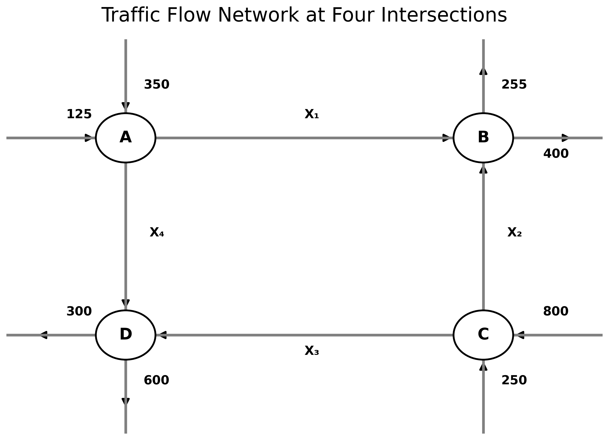

<div align="center">

# 🚦 Traffic Flow Modeling
### Linear Algebra & Discrete-Time State-Space Analysis

[](https://www.mathworks.com/)
[](LICENSE)
[]()
[]()

*A four-junction traffic network modeled using conservation laws, rank-deficient linear algebra, behavioral turning constraints, and discrete-time state-space dynamics — verified via eigenvalue stability.*

</div>

---

## 📌 Overview

This project models both **steady-state** and **dynamic** traffic flow across a four-junction road network. It covers:

| # | Topic | Method |
|---|-------|--------|
| 1 | Conservation of vehicles at each junction | Flow balance equations |
| 2 | Linear algebraic formulation | `AX = B` matrix system |
| 3 | Resolving rank deficiency | Behavioral turning ratio constraint |
| 4 | Dynamic driver adaptation | Discrete-time state-space model |
| 5 | Convergence verification | Eigenvalue / spectral radius analysis |

---

## 🗺️ Network Layout

The network consists of four junctions **A, B, C, D** with internal flows `x₁, x₂, x₃, x₄` and fixed external inflows/outflows at each node.

<div align="center">



</div>

> **External flows (veh/hr):** Node A receives 350 ↓ and 125 → &nbsp;|&nbsp; Node B exits 255 ↑ and 400 → &nbsp;|&nbsp; Node C receives 800 → and 250 ↑ &nbsp;|&nbsp; Node D exits 300 ← and 600 ↓

---

## 📘 Part I — Static Traffic Flow Model

### Governing Principle

At steady state: **Flow In = Flow Out** at every junction.

| Node | Equation |
|:----:|----------|
| **A** | `x₁ + x₄ = 475` |
| **B** | `x₁ + x₂ = 655` |
| **C** | `x₂ + x₃ = 1050` |
| **D** | `x₃ + x₄ = 870` |

### Matrix Formulation — `AX = B`

```
     A          X       B
⌈ 1  0  0  1 ⌉ ⌈x₁⌉   ⌈ 475 ⌉
| 1  1  0  0 | |x₂| = | 655 |
| 0  1  1  0 | |x₃|   |1050 |
⌊ 0  0  1  1 ⌋ ⌊x₄⌋   ⌊ 870 ⌋
```

> ⚠️ `rank(A) = 3 < 4` — the system is **rank deficient** and has infinitely many solutions. An additional constraint is required.

### Turning Ratio Constraint

At node A, driver behavior is captured by the splitting ratio:

```
x₁ / x₄ = 3 / 2
```

This constraint encodes real driver behavior and closes the system uniquely.

### ✅ Static Solution

| Flow | Value (veh/hr) | Status |
|:----:|:--------------:|--------|
| `x₁` | **285** | ✔ Non-negative |
| `x₂` | **370** | ✔ Non-negative |
| `x₃` | **680** | ✔ Non-negative |
| `x₄` | **190** | ✔ Non-negative |

All conservation equations satisfied. Solution is unique given the turning ratio constraint.

---

## 📘 Part II — Dynamic Traffic Flow Model

The static model assumes instantaneous equilibrium. To capture **gradual driver adaptation**, a discrete-time state-space system is used.

### State-Space Equation

```
X(k+1) = [ (1 − α)·I  +  α·P ] · X(k)  +  α·U
           \________________________/
                      Aᵈ
```

| Symbol | Description |
|--------|-------------|
| `α ∈ (0,1)` | Relaxation parameter — controls adaptation speed |
| `P` | Routing matrix — encodes driver turning fractions |
| `U` | External inflow vector |
| `Aᵈ` | Discrete-time state matrix |

### Model Parameters

**Relaxation parameter:** `α = 0.4`

**Routing matrix P and external inflow U:**

```
        P                         U
⌈ 0     0     0     0  ⌉       ⌈285⌉
| 0.30  0     0.35  0  |       | 0 |
| 0     0.70  0     0  |       | 0 |
⌊ 0     0     0.65  0  ⌋       ⌊190⌋
```

### ✅ Dynamic Steady-State Solution

| Flow | Value (veh/hr) |
|:----:|:--------------:|
| `x₁` | **285.00** |
| `x₂` | **161.13** |
| `x₃` | **112.79** |
| `x₄` | **263.31** |

---

## 📊 Stability Analysis

Asymptotic stability is verified by checking that all eigenvalues of `Aᵈ` lie strictly inside the unit circle.

| Eigenvalue | Value | `\|λᵢ\| < 1` |
|:----------:|:-----:|:---:|
| λ₁ | 0.600 | ✅ |
| λ₂ | 0.600 | ✅ |
| λ₃ | **0.874** | ✅ ← dominant |
| λ₄ | 0.326 | ✅ |

```
Spectral radius:  ρ(Aᵈ) = max|λᵢ| = 0.874 < 1  ✅
```

> ✅ **The system is asymptotically stable.** All disturbances decay over time. The network converges to equilibrium for any initial condition.

---

## 📈 Convergence Simulation

The simulation initializes all flows at zero and iterates the state-space equation until convergence. All four flows smoothly reach their steady-state values within approximately **30 time steps**.

<div align="center">


</div>

| Flow | Start | Steady-State | Behaviour |
|:----:|:-----:|:------------:|-----------|
| `x₁` (blue)   | ~170 | 285 | Monotone rise to equilibrium |
| `x₂` (red)    | ~170 | 161 | Rapid decay to equilibrium |
| `x₃` (yellow) | ~235 | 113 | Sharp monotone decay |
| `x₄` (purple) | ~245 | 263 | Overshoot then gradual settle |

---

## ▶️ How to Run

Clone the repository and run each script in MATLAB:

```matlab
% Step 1 — Solve static model (Part I)
static_model

% Step 2 — Solve dynamic model + eigenvalue analysis (Part II)
dynamic_model

% Step 3 — Simulate convergence and generate plot
convergence_simulation
```

> **Requirements:** MATLAB R2021a or later. No additional toolboxes required.

---

## 📂 Repository Structure

```
Traffic-Flow-Model/
│
├── static_model.m             # Part I: Linear system + turning ratio constraint
├── dynamic_model.m            # Part II: State-space formulation + eigenanalysis
├── convergence_simulation.m   # Iterative simulation + convergence plot
│
├── results/
│   ├── Problem.png            # Network diagram (problem statement)
│   └── Convergence_output.png # Simulation convergence plot
│
├── LICENSE
└── README.md
```

---

## 🧠 Key Insights

**Static Model**
- The node-balance system is rank deficient — a turning ratio constraint is required to obtain a unique solution.
- The constraint encodes real driver behavior and is physically motivated, not arbitrary.

**Dynamic Model**
- Captures the gradual redistribution of traffic as drivers adapt over successive time steps.
- The relaxation parameter `α` controls convergence speed — larger `α` yields faster but potentially more oscillatory adaptation.
- The spectral radius `ρ(Aᵈ) < 1` guarantees asymptotic stability for all `α ∈ (0,1)` with this routing matrix.

---

## 🚀 Future Work

- [ ] Capacity-constrained optimization (link flow upper bounds)
- [ ] Nonlinear congestion modeling via BPR function
- [ ] Sensitivity analysis of `α` on convergence rate and overshoot
- [ ] Continuous-time formulation via ODEs
- [ ] Validation against real-world traffic count data

---

## 📜 License

Licensed under the [MIT License](LICENSE).
